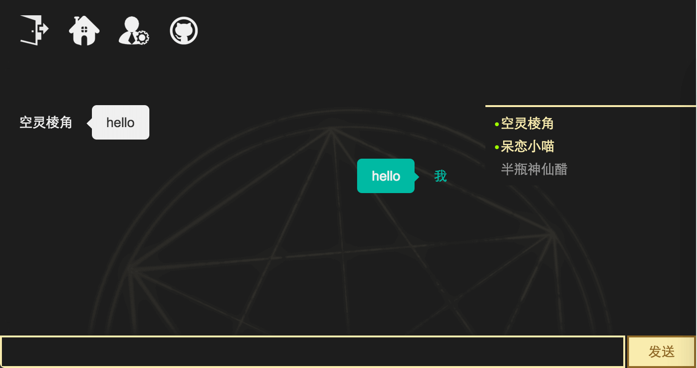

# 多人聊天室 #
### express + mongodb + websocket ###



*****

参考资料

+ [Node.js开发指南](https://github.com/sunmengyuan/book/blob/master/Node.js%E5%BC%80%E5%8F%91%E6%8C%87%E5%8D%97.pdf)
+ [深入浅出Node.js](https://github.com/sunmengyuan/book/blob/master/%E6%B7%B1%E5%85%A5%E6%B5%85%E5%87%BANode.js.pdf)
+ [深入学习MongoDB](https://github.com/sunmengyuan/book/blob/master/%E6%B7%B1%E5%85%A5%E5%AD%A6%E4%B9%A0MongoDB.pdf)
+ [MongoDB for GIANT Ideas | MongoDB](https://www.mongodb.com/)
+ [mongoose文档](http://www.nodeclass.com/api/mongoose.html)
+ [Express - 基于Node.js平台的web应用开发框架](http://www.expressjs.com.cn/)
+ [Socket.IO](http://socket.io/)

*****

作者：呆恋小喵

欢迎参观：<http://www.miaomie.tech>

*****

_数据库：chat_

_数据表：users_

```javascript
var userSchema = new Schema({
    id: String,
    nickname: String,
    password: String,
    sex: String,
    tel: String,
    qq: String,
    intro: String
});
```

*****

### pages ###
+ __/__ (首页) [效果图](./materials/index.png)
+ __/edit/myinfo__ (个人设置页) [效果图](./materials/settings.png)
+ __/chatroom__ (聊天室) [效果图](./materials/chatroom.png)

*****

### emphasis ###
+ __用户上线__

    服务端

    ```javascript
    socket.on('online', function (data) {
        User.find({id: data.id}, {}, {}, function (err, result) {
            if (!err) {
                io.sockets.emit('online', result[0]);
                _this.onlines.push(data.id);
            }
        });
    });
    ```

    客户端

    ```javascript
    socket.emit('online', {
        id: user.id,
        nickname: user.nickname
    });
    ```

    ```javascript
    socket.on('online', function (data) {
        _this.sendNews(data, '进入聊天室');

        var $user = $('#user_' + data.id);
        if ($user.length) {
            $user.removeClass('offline').addClass('online');
        } else {
            $user = $('#module_member').html()
                .replace('$id', data.id)
                .replace('$status', 'online')
                .replace('$nickname', data.nickname)
                .replace('$info', JSON.stringify(data));
        }
        _this.members.prepend($user);
    });
    ```

+ __用户下线__

    服务端
    
    ```javascript
    socket.on('disconnect', function () {
        if (cur_user) {
            _this.activers[cur_user.id] = false;

            var t = setTimeout(function () {
                var status = _this.activers[cur_user.id];
                if (!status) {
                    io.sockets.emit('offline', {
                        id: cur_user.id,
                        nickname: cur_user.nickname
                    });
                    method.rmArrElem(_this.onlines, cur_user.id);

                    delete _this.activers[cur_user.id];
                }
            }, 1000);
        }
    });
    ```

    客户端
    
    ```javascript
    socket.on('offline', function (data) {
        _this.sendNews(data, '离开聊天室');

        var $user = $('#user_' + data.id);
        if ($user.length) {
            $user.removeClass('online').addClass('offline');
        }
        _this.members.append($user);
    });
    ```

+ __用户发送信息__

    服务端
    
    ```javascript
    socket.on('message', function (data) {
        io.sockets.emit('message', {
            user: {
                id: data.user.id,
                nickname: data.user.nickname
            },
            message: data.message
        });
    });
    ```

    客户端

    ```javascript
    var $btn = $('.js_send');
    var $input = $('.js_input');
    var method = function () {
        var value = $input.val();
        var cur_user = global.cur_user;

        if (value) {
            $('.js_active').removeClass('js_active');

            socket.emit('message', {
                user: {
                    id: cur_user.id,
                    nickname: cur_user.nickname
                },
                message: value
            });
            $input.val('');

            var $item = $('#module_message').html()
                .replace('$view', 'self')
                .replace('$nickname', '我')
                .replace('$message', value);
            _this.message.append($item);
            _this.scrolling();
        }
    };
    $btn.on('click', function () {
        method();
    });
    $input.on('keydown', function (e) {
        $('.js_dialog').length || (e.keyCode == '13') && method();
    });
    ```

    ```javascript
    socket.on('message', function (data) {
        $('.js_active').removeClass('failed').find('p').removeClass('js_resend');

        if (global.cur_user.id != data.user.id) {
            var $item = $('#module_message').html()
                .replace('$view', 'other')
                .replace('$nickname', data.user.nickname)
                .replace('$message', data.message);
            _this.message.append($item);
            _this.scrolling();
        }
    });
    ```