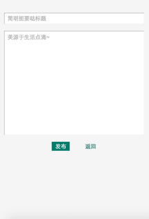

# 简易微博系统 #
### express + mongodb + fs ###

__用户注册本站后即可发布个人日记，并可粉丝他人、收藏他人日记__

后续功能：评论日记、关注用户

*****

_数据库：expo_

_数据表：users、diaries_

*****

作者：呆恋小喵

欢迎参观：<http://www.miaomie.tech>

*****

### pages ###
+ 首页 __/__
	+ 最新注册用户列表
	+ 精选日记列表
	+ 登录
+ 注册页 __/register__
	+ 注册
+ 用户主页 __/profile/:id__
	+ 用户信息
	+ 用户日记列表	
+ 发布日记页 __/diary/publish__
	+ 发布日记
+ 日记详情页 __/diary/:id__
	+ 作者信息
	+ 日记详情

   

### modules ###
+ `require('log')`	
	+ 登录 __log.login()__	
	+ 注册 __log.register()__	
	+ 注销 __log.logout()__	
	+ 退出登录 __log.exit()__	
+ `require('find')`
	+ 查询当前记录 __find.info()__	
	+ 查询所有记录 __find.all()__	
+ `require('diary')`
	+ 发布日记 __diary.publish()__	
	+ 编辑日记 __diary.edit()__	
	+ 移除日记 __diary.remove()__
	+ 点赞日记 __diary.favour()__			
+ `require('user')`
	+ 编辑用户信息 __user.edit()__		
	+ 关注用户 __user.attention()__