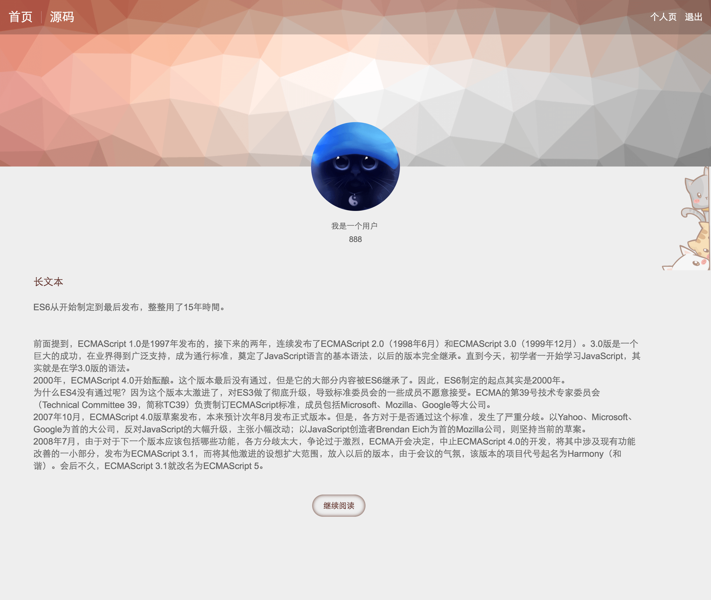

# 简易个人空间 #

### vue + express + mongodb + fs ###

__一个使用 vue.js 开发的练习项目__

主要功能：用户个人信息及用户发布文章的增删改查

*****



*****

__启动 mongodb__

```bash
cd mongodb

mkdir -p data/db

cd mongodb/bin

./mongod --dbpath ../data/db
```

__启动 express__

```bash
cd zone

npm install

cd bin

./www
```

__启动 vue__

```bash
cd zone/fe

npm install

npm run dev
```

*****

参考资料

+ [vue.js](http://cn.vuejs.org/)

+ [Node.js开发指南](https://github.com/sunmengyuan/book/blob/master/Node.js%E5%BC%80%E5%8F%91%E6%8C%87%E5%8D%97.pdf)

+ [深入浅出Node.js](https://github.com/sunmengyuan/book/blob/master/%E6%B7%B1%E5%85%A5%E6%B5%85%E5%87%BANode.js.pdf)

+ [深入学习MongoDB](https://github.com/sunmengyuan/book/blob/master/%E6%B7%B1%E5%85%A5%E5%AD%A6%E4%B9%A0MongoDB.pdf)

+ [MongoDB for GIANT Ideas | MongoDB](https://www.mongodb.com/)

+ [mongoose文档](http://www.nodeclass.com/api/mongoose.html)

*****

作者：呆恋小喵

欢迎参观：<https://sunmengyuan.github.io/garden/>

*****

_数据库：zone_

_数据表：users、articles_

```javascript
var userSchema = new Schema({
    id: String,
    nickname: String,
    password: String,
    intro: String,
    portrait: String,
    articles: []
});
```
```javascript
var articleSchema = new Schema({
    id: String,
    author: String,
    title: String,
    content: String,
    cover: String
});
```

*****

### #pages ###

+ __/__ (首页) [效果图](./materials/index.png)

+ __/register__ (注册页) [效果图](./materials/register.png)

+ __/publish__ (发布文章页) [效果图](./materials/publish.png)

+ __/profile/:id__ (用户主页) [效果图](./materials/profile.png)

+ __/article/:id__ (文章详情页) [效果图](./materials/article.png)

### #components ###

+ __Navigation__ (导航)

+ __Banner__ (横幅)

+ __Users__ (用户列表)

+ __Articles__ (文章列表)

+ __UserInfo__ (用户信息)

### #requests ###

+ GET __/profile/:id__

+ GET __/article/:id__

+ GET __/users?page=[page]__

+ GET __/articles?page=[page]&user=[id]__

+ GET __/article?page=[page]&id=[id]__

+ POST __/login__

+ POST __/register__

+ POST __/upload/portrait__

+ POST __/upload/cover__

+ POST __/edit/user/:id__

+ POST __/edit/article/:id__

+ POST __/publish__